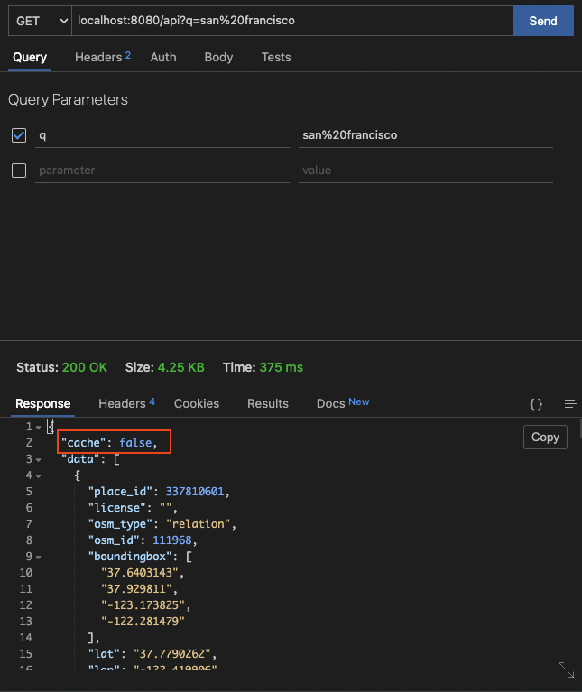

# Redis Caching With Golang MicroService

### Starting (M1-ARM64)

```
go mod tidy

```


```
Installing a Docker image

docker compose up --build

```

```
Api Request

http://localhost:8080/api?q=san%20francisco

Cache:False

Again Request

Cache:True :)

But it is deleted after 90 seconds!

```


## 1.Request

<p>
    

</p>

## 2.Request

<p>
    

</p>
